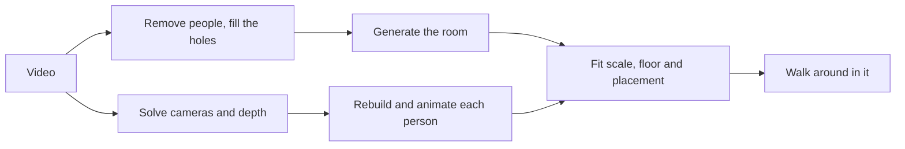

# Orbis Engine

Anything ever filmed, in 4D.

Orbis turns an ordinary video into a 3D world you can walk around in. Put on a Quest, or use WASD
in a browser, and you are standing in the room while the moment plays out around you as it was
recorded, with the original sound. In one scene you can walk up to a person and talk to them, or
pick up what they are holding.

It works on phone clips and on movie shots. Built at Hack the North 2026.

## How it works



| Step      | What happens                                                    | Built on                                                       |
| --------- | --------------------------------------------------------------- | -------------------------------------------------------------- |
| Cameras   | Find where the camera was in every frame, plus depth            | [Pi3X](https://github.com/yyfz/Pi3)                            |
| Clean     | Mask the people out and fill the holes                          | Mask R-CNN, [LaMa](https://github.com/advimman/lama)           |
| Room      | Generate a full Gaussian-splat room from the cleaned video      | [Marble](https://docs.worldlabs.ai/api), OpenAI vision         |
| Correct   | Train the room against the real frames (optional)               | [gsplat](https://github.com/nerfstudio-project/gsplat)         |
| People    | Track each person and rebuild them as an animated avatar        | [LHM](https://huggingface.co/3DAIGC/LHM-500M-HF)               |
| Placement | Fit scale and floor so feet land where they stood               |                                                                |
| Viewer    | Walk around in a browser or a Quest, synced to the source video | Three.js, [Spark](https://sparkjs.dev), WebXR, OpenAI Realtime |

GPU stages run on [Modal](https://modal.com). Scenes are stored in S3.

## What we tried first

| Idea                                | Tried                                                                                                                                                                                                                | What happened                                                              |
| ----------------------------------- | -------------------------------------------------------------------------------------------------------------------------------------------------------------------------------------------------------------------- | -------------------------------------------------------------------------- |
| Rebuild the room from the footage   | [Depth Anything 3](https://github.com/ByteDance-Seed/Depth-Anything-3), [VGGT](https://github.com/facebookresearch/vggt), [Brush](https://github.com/ArthurBrussee/brush)                                            | Great from the camera's spot, broken everywhere else                       |
| Generate only the missing views     | [Stable Virtual Camera](https://github.com/Stability-AI/stable-virtual-camera), [GeoNVS](https://github.com/MinJunKang/GeoNVS), [GEN3C](https://github.com/nv-tlabs/GEN3C), [Lyra](https://github.com/nv-tlabs/lyra) | A courtyard that did not exist, grey mush, a shop sign turned to gibberish |
| Rebuild people from depth           | [V-DPM](https://github.com/eldar/vdpm), [PIFuHD](https://github.com/facebookresearch/pifuhd)                                                                                                                         | Melted limbs                                                               |
| Refine body poses against the video | our own optimiser                                                                                                                                                                                                    | Worse. One camera cannot tell how far away a hand is                       |

A camera walking forward only records about 41° off its own path, so you cannot rebuild what was
never filmed. What worked was generating the whole room, then correcting it with the footage.

Full list in the [research log](docs/research-log.md). Dead ends in [known limits](docs/known-limits.md).

## Run the viewer

You need [Bun](https://bun.sh/docs/installation) 1.2.21+ and Chrome.

```sh
git clone --single-branch --branch main https://github.com/dtpu/OrbisEngine.git
cd OrbisEngine
bun install --frozen-lockfile
bun run demo
```

Open http://127.0.0.1:5399/demo.html and pick a scene.

Scenes are not in this repo. You have three ways to get one:

- **Team credentials:** put the read-only keys in `.env.local` (see `.env.example`).
- **A scene bundle:** `tar -xzf orbis-sample.tar.gz`, then `WANDER_ASSETS_MODE=local bun run demo`.
- **Your own clip:** see below.

| Key           | Does          |
| ------------- | ------------- |
| W A S D       | Walk          |
| Drag or click | Look around   |
| Shift         | Run           |
| Space         | Play or pause |
| R             | Reset         |
| M             | Overhead map  |

### Quest

1. Enable Developer Mode and plug in the headset.
2. Run `adb reverse tcp:5399 tcp:5399`.
3. In the Meta Browser open `http://localhost:5399/demo.html?xr=1` and press Enter VR.

B on the right controller opens the scene list. The desktop page shows what the headset sees.

To talk to a person and pick up the bottle, open `fourd.html?demo=elevator&interact=1&xr=1` with
`OPENAI_API_KEY` set on the server. More options in [developing](docs/DEVELOPING.md#quest-details).

## Process your own clip

You need [uv](https://docs.astral.sh/uv/), Python 3.11 or 3.12, FFmpeg, and keys for Modal, World
Labs and OpenAI in `.env.author` (`.env.example` lists them).

```sh
uv sync --locked --group inference
set -a; source .env.author; set +a
uv run --locked --group inference scripts/run_clip.py \
  --clip /path/to/clip.mp4 --name myclip \
  --marble video --all-people --fps 12 --skip-finetune --no-publish
```

- The run stops once so you can check the cleaned frames. Run it again with `--gate-pass` to continue.
- Running the same command after a crash resumes where it stopped.
- A 10-second clip takes about 25 minutes, roughly $0.15 of Modal GPU plus 1,600 Marble credits.
- Read [paid recovery](docs/paid-recovery.md) before retrying a failed paid stage.

**Clips that work:** one continuous shot, 5 to 15 seconds, people at least 150 px tall, some
sideways camera movement, decent light.

## Limits

- Anything the camera never saw is generated. It can look plausible and be wrong.
- Faces under about 64 px tall in the source come out invented.
- A dark clip, or one with almost no camera movement, fails.
- Smoke, fire and water do not reconstruct from one camera.
- Cuts are not handled. It processes one continuous shot at a time.

## More

- [Developing](docs/DEVELOPING.md): code map, checks, Quest options, pipeline flags, repo history.
- [Research log](docs/research-log.md) and [known limits](docs/known-limits.md).
- [Audio](docs/audio.md), [objects](docs/objects.md), [interactive scene](docs/interactive-world.md), [unattended runs](docs/unattended-runs.md).

## Credits

Aayan Karmali, Austin Jian, Daniel Pu and James Li.

The Tears of Steel scene uses excerpts of **(CC) Blender Foundation | [mango.blender.org](https://mango.blender.org/)**,
[CC BY 3.0](https://creativecommons.org/licenses/by/3.0/). Phone clips are our own footage. Movie
excerpts used in testing are not redistributed here.
