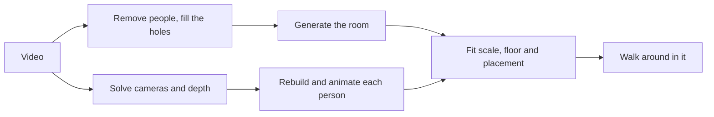

# Orbis Engine

Anything ever filmed, in 4D.

Orbis turns an ordinary video into a 3D world you can walk around in. Put on a Quest, or use WASD
in a browser, and you are standing in the room while the moment plays out around you as it was
recorded, with the original sound. In one scene you can walk up to a person and talk to them, or
pick up what they are holding.

It works on phone clips and on movie shots. Built at Hack the North 2026.

The code, env vars and package still use the project's first name, Wander.

## How it works



1. **Cameras.** [Pi3X](https://github.com/yyfz/Pi3) works out where the camera was in every frame, plus depth.
2. **Room.** People are masked out with Mask R-CNN and the holes filled with [LaMa](https://github.com/advimman/lama). [World Labs Marble](https://docs.worldlabs.ai/api) generates a full Gaussian-splat room from the cleaned video. An OpenAI vision model writes the scene description that goes with it and screens the result. Optionally the room is then trained against the real frames with [gsplat](https://github.com/nerfstudio-project/gsplat), so invented surfaces get replaced by recorded ones.
3. **People.** Each person is tracked and rebuilt as an [LHM](https://huggingface.co/3DAIGC/LHM-500M-HF) avatar of about 40,000 Gaussians, driven by their motion in the video.
4. **Placement.** Scale and floor are fitted so feet land where they actually stood.
5. **Viewer.** Three.js with [Spark](https://sparkjs.dev) for splats and WebXR for Quest. The source video is the master clock, so motion and audio stay in sync. The voice conversation uses the OpenAI Realtime API.

GPU stages run on [Modal](https://modal.com). Scenes are stored in S3 and streamed by a small local server.

## What we tried first

**Rebuilding the room from the footage.** [Depth Anything 3](https://github.com/ByteDance-Seed/Depth-Anything-3),
[VGGT](https://github.com/facebookresearch/vggt) and [Brush](https://github.com/ArthurBrussee/brush)
gave us a room that looked great from where the camera had been and fell apart everywhere else.
We measured why: a camera walking forward only records about 41° off its own path, and coverage at
90° was zero. You cannot rebuild what was never filmed.

**Generating only the missing views.** [Stable Virtual Camera](https://github.com/Stability-AI/stable-virtual-camera),
[GeoNVS](https://github.com/MinJunKang/GeoNVS), [GEN3C](https://github.com/nv-tlabs/GEN3C) and
[Lyra](https://github.com/nv-tlabs/lyra). We got a courtyard that did not exist, grey mush, a real
shop sign rewritten into gibberish, and a scene too slow to walk through.

**People.** [V-DPM](https://github.com/eldar/vdpm) and [PIFuHD](https://github.com/facebookresearch/pifuhd)
gave melted limbs before LHM worked. Refining body poses against the footage made them worse,
because one camera cannot tell you how far away a hand is.

What worked was to stop reconstructing the room, generate all of it, and then correct it with the
footage. The [research log](docs/research-log.md) has every approach with its result, and
[known limits](docs/known-limits.md) lists the dead ends.

## Run the viewer

You need [Bun](https://bun.sh/docs/installation) 1.2.21+ and Chrome.

```sh
git clone --single-branch --branch main https://github.com/dtpu/OrbisEngine.git
cd OrbisEngine
bun install --frozen-lockfile
bun run demo
```

Open http://127.0.0.1:5399/demo.html and pick a scene.

Scene files are not in this repo. They live in our private S3 bucket, so out of the box this only
works with the team's read-only credentials in `.env.local` (see `.env.example`). Without them you
can run a scene bundle someone gives you:

```sh
tar -xzf orbis-sample.tar.gz        # unpacks into public/
WANDER_ASSETS_MODE=local bun run demo
```

or process your own clip, below. Details are in [shared assets](docs/shared-assets.md).

**Controls:** WASD to walk, drag or click to look, Shift to run, Space to play or pause, R to
reset, M for the overhead map.

**Quest:** enable Developer Mode, plug in the headset, then:

```sh
adb reverse tcp:5399 tcp:5399
```

Open `http://localhost:5399/demo.html?xr=1` in the Meta Browser and press Enter VR. B on the right
controller opens the scene list. The desktop page shows a live view of what the headset sees. For
the voice and bottle scene, open `fourd.html?demo=elevator&interact=1&xr=1` with an
`OPENAI_API_KEY` set on the server. Movement options and the rest are in
[developing](docs/DEVELOPING.md#quest-details).

## Process your own clip

You need [uv](https://docs.astral.sh/uv/), Python 3.11 or 3.12, FFmpeg, a Modal account, a World
Labs API key and an OpenAI key. Put the keys in `.env.author` (`.env.example` lists them).

```sh
uv sync --locked --group inference
set -a; source .env.author; set +a
uv run --locked --group inference scripts/run_clip.py \
  --clip /path/to/clip.mp4 --name myclip \
  --marble video --all-people --fps 12 --skip-finetune --no-publish
```

The run stops once so you can check the cleaned frames (people gone, room intact). Run the same
command again with `--gate-pass` to continue. Running it again after a crash resumes where it
stopped. A 10-second clip takes about 25 minutes and costs roughly $0.15 of Modal GPU plus 1,600
Marble credits.

Clips that work: one continuous shot, 5 to 15 seconds, people at least 150 px tall, some sideways
camera movement, decent light. Every paid stage is recorded in a ledger, so read
[paid recovery](docs/paid-recovery.md) before retrying a failed one.

## Limits

- Anything the camera never saw is generated. It can look plausible and be wrong.
- Faces under about 64 px tall in the source come out invented.
- A dark clip, or one with almost no camera movement, fails.
- Smoke, fire and water do not reconstruct from one camera.
- Cuts are not handled. It processes one continuous shot at a time.

## More

- [Developing](docs/DEVELOPING.md): code map, checks, Quest options, pipeline flags, repo history.
- [Research log](docs/research-log.md) and [known limits](docs/known-limits.md).
- [Audio](docs/audio.md), [objects](docs/objects.md), [interactive scene](docs/interactive-world.md), [unattended runs](docs/unattended-runs.md).

## Credits

Aayan Karmali, Austin Jian, Daniel Pu and James Li.

The Tears of Steel scene uses excerpts of **(CC) Blender Foundation | [mango.blender.org](https://mango.blender.org/)**,
[CC BY 3.0](https://creativecommons.org/licenses/by/3.0/). Phone clips are our own footage. Movie
excerpts used in testing are not redistributed here.
