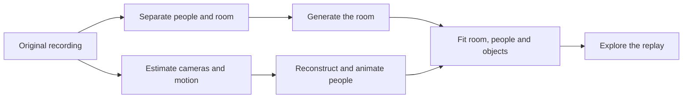

# Showing the pipeline to judges

This is an implementation plan. The walkthrough and incremental archive checkpoints are not built
or verified yet. The intended experience is a simple visual story: what each step does, what it
produces, and how that result contributes to the final replay. Downloads are not required.

Start with the accepted gym as the showcase, after inventorying its retained intermediates. Use
existing bytes and captures; a missing historical output stays marked unavailable rather than
triggering another paid run or being replaced by an unrelated example.

## Six visible steps

| Step | What judges see | What the label explains |
| --- | --- | --- |
| 1. Original recording | The actual source clip and selected interval | Recorded evidence and the input to this run. |
| 2. Understand motion | Camera path/point cloud and tracked-person overlay | Cameras, depth and people are estimated from the footage. |
| 3. Separate people and room | Original frame, person mask and cleaned video | Segmentation separates the person; removed regions contain generated fill. |
| 4. Build room and people | Generated environment beside the inferred avatar | Room and person branches run separately; unseen geometry is inferred. |
| 5. Fit and animate | Source/replay pair, object tracks and placement evidence | Motion and placement are fitted; show remaining contact or alignment limits. |
| 6. Explore the replay | A short advancing replay and a link to the interactive viewer | Packaging, original audio when available, and actual playback/walking checks. |

Each card has one real preview, one short explanation and a clear state. Clicking it opens the
preview; an optional evidence disclosure shows the source time and checks. Keep hashes, model
versions and execution details out of the main story. Distinguish completed, reused, skipped,
failed and unavailable steps; completed processing does not imply accepted visual quality.

This is the conceptual story. The detailed dependencies come from the actual run's single- or
multiperson graph. Use synchronized comparisons only when source-time/camera correspondence is
verified; otherwise label them as illustrative views.

## Expand each card into smaller steps

Keep the six cards as the overview. Opening a card reveals a short sequence of substeps, each with
its input, one-sentence action and actual output preview. The people and room branches can run
independently; the table is a presentation order, not a claim that the runner executes it serially.

| Card | Smaller step | Actual output to show |
| --- | --- | --- |
| Original recording | Select one continuous shot and trim its interval | Full clip timeline with the selected excerpt highlighted. |
| Original recording | Sample frames and retain the recording's time reference | A frame strip with source times; keep original audio attached to its interval. |
| Understand motion | Estimate camera movement and scene depth | Estimated camera path, depth image and a small point-cloud preview. |
| Understand motion | Detect and track people through the shot | Bounding boxes and stable person IDs; show this only when the run retained tracking evidence. |
| Separate people and room | Choose an avatar reference for each person | The actual selected source frame and crop, including occlusion or framing limits. |
| Separate people and room | Segment the selected person from that frame | Source image → person mask → isolated person cutout. |
| Separate people and room | Find people to remove from the room input across time | Removal-mask overlay on sampled frames, including any reviewed moving-object masks. |
| Separate people and room | Remove them and fill the exposed background | Original → masked image → inpainted image, plus the cleaned video when retained. |
| Separate people and room | Review the cleaned input before generation | Selected cleaned-frame comparisons and the recorded review state; mark bypassed review explicitly. |
| Build room and people | Infer a 3D person from the prepared cutout | A rotatable or prerecorded turntable of the inferred avatar. Label unseen appearance as inferred. |
| Build room and people | Estimate body poses through the original shot | Skeleton/pose overlay over the recording, using retained poses at their actual sample times. |
| Build room and people | Apply those poses to the 3D person | The animated person alone, with the room hidden, compared with the source action. |
| Build room and people | Submit the reviewed room input to Marble | The exact submitted video or stills and a short description, followed by the generated room. |
| Fit and animate | Prepare moving props when the run has them | Source crop/detection, fitted trajectory and prop model or labeled proxy; distinguish manual fitting. |
| Fit and animate | Align people, props and room in shared coordinates | Before/after placement and scale views, with the estimated cameras or floor as references. |
| Fit and animate | Review motion, identity, placement and contact | Matched source/replay views and available check results, retaining visible failures and unknowns. |
| Explore the replay | Package motion and synchronize the recording | A short replay with the original audio when available; optional details explain lossless packaging. |
| Explore the replay | Load the final scene and test exploration | The interactive replay, walking/map controls and any reviewed collision surfaces. |

The clearest small demonstrations are **person frame → mask → cutout → 3D avatar → animated
avatar** and **original room footage → removal masks → cleaned input → generated 3D room**.
Camera/depth estimates help align those branches before final playback. For multiple people, repeat
the person branch per identity and bring their animations together at placement.

Reference-person segmentation and room-removal masking are separate outputs in the current
pipeline; do not imply that one saved mask necessarily serves both. Likewise, creating an avatar
and estimating its motion are separate operations. A generated room is not a reconstruction of the
moving person, and a collider constrains the viewer rather than repairing the actor's contact.

For a historical showcase such as the accepted gym, display the input actually used by that run.
The current video-first default does not establish that an older world used video. Props and
collision fitting can be optional or manually authored; the walkthrough must not advertise them as
universal automatic stages. The automated object lane currently targets supported thrown-object
cases, while the gym's held dumbbells have their own authored tracks.

Each available substep should have its own artifact-registry entry linking the preview to the exact
retained output. Several substeps currently live inside one runner stage, so finer persistence needs
explicit output hooks; a progress label alone is not a saved checkpoint. Keep existing raw outputs
and derive inexpensive previews from them without rerunning inference. Use **unavailable** for
missing historical evidence and distinguish **generated**, **estimated**, **recorded** and
**manually fitted** content in the expanded view.

## What needs to be saved

The current publisher preserves `public/`, `.context/run/` and an explicitly supplied evidence
directory. It runs at normal finalization, including failure, but a hard kill can miss that hook.
Default discovery does not cover every configured cleaned-video, Marble-receipt or diagnostic
location. Native LHM has durable volume recovery; other stages do not all have that contract.

Add an explicit artifact registry rather than relying on a whole-directory scan. Reference:

- Source/trim identity, source hash and measured frame/time mapping where known.
- Masks, cleaned input, camera estimates, person preparation, geometry and motion outputs.
- Exact Marble request/input evidence and provider operation IDs, with sensitive URLs removed.
- Object tracks, placement/check reports, packaged sequences, original audio and visual captures.
- Actual code/model/settings, attempt identity, dependencies, reuse/recovery status and output hashes.

Keep large PLY/NPZ/PT files in the private archive for recovery. The judge view uses small selected
images, camera-path renders and short video previews, linked back to those exact originals. It should
not load an entire animation or model-weight file merely to display the pipeline diagram.

## Persistence and delivery

After a stage closes its output files, record an immutable manifest and queue verified copies for
private S3. An atomic local journal/outbox retains pending work across interruptions. Upload blobs
by content hash, commit stage/run manifests last, and resume storage transfers without rerunning
inference. Existing paid-attempt ledgers remain authoritative; archiving must never reset attempts
or turn an unknown provider outcome into permission to resubmit.

Use a dedicated archive-only uploader with bounded concurrency and conditional metadata updates.
Do not run the whole-tree publisher after each stage or change the shared demo snapshot mid-run.
Capture external output paths explicitly, and do not treat a hardlink to a mutable file as a frozen
snapshot. Large artifacts need resumable multipart support before it is promised.

Publish an allowlisted preview bundle under `/reviews/pipeline/<runId>/` using existing private
viewer storage. Keep raw archive access author-only. The judge manifest must omit credentials,
local paths, signed provider URLs and raw request headers; secret regexes alone are insufficient.
Load one expanded video/3D preview at a time, with static thumbnails for the other steps.

## Implementation order and acceptance

1. Inventory/backfill one existing accepted run without API/model execution. Validate all referenced
   hashes and mark absent or uncertain historical metadata explicitly.
2. Build the six-card walkthrough from existing previews. Check source linkage, generated/observed
   labels, mobile layout, keyboard access, missing previews and return to the final replay.
3. Add atomic stage manifests, the local outbox and archive-only checkpoints. Exercise interruption,
   corruption, duplicate artifacts, concurrent updates, partial outputs and failed stages with fixtures.
4. Connect runner transitions without changing inference arguments or recovery/attempt semantics.
   Restoring the manifest graph must launch no jobs and preserve all prior attempts.
5. Verify the sanitized preview bundle, then publish only its reviewed paths with a conditional
   snapshot update. Check real advancing playback and bytes loaded, one browser at a time.

Success means judges can understand each visible step through actual output, while the retained
artifact graph supports recovery and truthful provenance. It does not require another generation,
a new public deployment, raw artifact downloads or a claim that every intermediate is correct.
